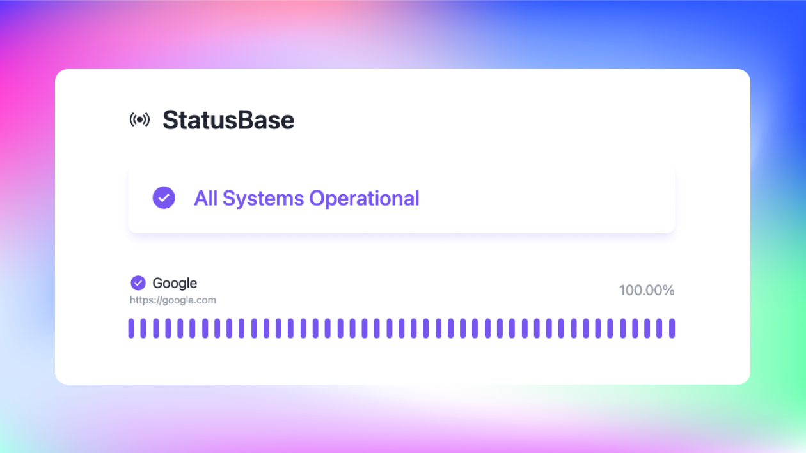

<!-- PROJECT LOGO -->
<br />
<p align="center">
  <a href="https://github.com/zernonia/statusbase">
    
  </a>

  <h3 align="center">StatusBase</h3>

  <p align="center">
   Uptime monitoring tool & beautiful status pages <br><br> Powered by <a href="https://content.nuxtjs.org/" target="_blank"> Nuxt Content v2!</a>
    <br />
    <strong>Free • Open Source • API ready </strong>
    <br />
    <br />
    <a href="https://statusbase.vercel.app/">View Demo</a>
    ·
    <a href="https://github.com/zernonia/statusbase/issues">Report Bug</a>
    ·
    <a href="https://github.com/zernonia/statusbase/issues">Request Feature</a>
  </p>
</p>



## Inspiration

I saw a lot of Status Page Software-as-a-Service (SAAS) out there lately, but I want to create one that allow users to freely host it themselves, and configure it to their hearts content.

On top of that, I find that this a golden opportunity to play with [Nuxt Content v2](https://content.nuxtjs.org/) 😆

## 🚀 Features

- 🤩 Free
- 📖 Open-Source
- 🚀 Host it on [platforms](https://v3.nuxtjs.org/guide/deploy/presets)
- 📝 Write incident report in Markdown

### 🔨 Built With

- [Nuxt 3](https://v3.nuxtjs.org/)
- [Nuxt Content v2](https://content.nuxtjs.org/)
- [WindiCSS](https://windicss.org/)

## Setup instructions

> **Warning**
> This project is still under development

1. Fork the repository
2. Update `cron` frequency on `.github/workflows/health-check.yaml`
3. Create `[name].yaml` on `/content/urls` (eg: doc.yaml)
4. Copy the template below to your `yaml` file created in step 2

```yaml
url: "https://docs.zernonia.com"
title: "Doc"
description: "Documentation website for zernonia"
# IMPORTANT! url must be first line
# you can add any extra field here
```

5. Set up on any [platform](https://v3.nuxtjs.org/guide/deploy/presets) you ant
6. Celebrate! 🎉

## How it works?

This project uses GitHub actions to wake up every hour and run a shell script (`health-check.sh`). This script runs curl on every .yaml file in your `/content/urls` directory and appends the result of that run to a log file and commits it to the repository.

All thanks to **Nuxt Content v2**, we easily fetch the log data, as well as documented incidents report easily and display it on the website.

However, there's a downside with using GitHub Actions as CRON, which is the scheduled [delayed](https://github.community/t/scheduled-jobs-are-not-running-on-time/121271/6). Other than that, the current Nuxt Content v2 doesn't support [remote git sources yet](https://github.com/nuxt/content/issues/1049), so we have to rebuild the apps every 30 minutes (depending on the frequeny you set in `.github/workflows/health-check.yaml`), which is not ideal.

## ➕ Contributing

Contributions are what make the open source community such an amazing place to be learn, inspire, and create. Any contributions you make are **greatly appreciated**.

1. Fork the Project
2. Create your Feature Branch (`git checkout -b feature/AmazingFeature`)
3. Commit your Changes (`git commit -m 'Add some AmazingFeature'`)
4. Push to the Branch (`git push origin feature/AmazingFeature`)
5. Open a Pull Request

## 📜 License

Distributed under the MIT License. See `LICENSE` for more information.

# 📧 Contact

Zernonia - [@zernonia](https://twitter.com/zernonia) - zernonia@gmail.com

Also, if you like my work, please buy me a coffee ☕😳

<a href="https://www.buymeacoffee.com/zernonia" target="_blank">
    
  </a>
